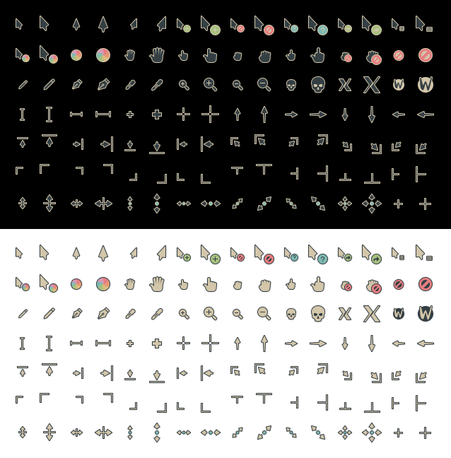

# Everforest cursors

Everforest Medium Dark cursor theme, based on [phinger-cursors](https://github.com/phisch/phinger-cursors).



### Manually

For a manual installation, download and extract the [latest release](https://github.com/talwat/everforest-cursors/releases/latest/download/everforest-cursors-variants.tar.bz2) into the `~/.icons` directory.

```sh
wget -cO- https://github.com/talwat/everforest-cursors/releases/latest/download/everforest-cursors-variants.tar.bz2 | tar xfj - -C ~/.icons
```

This installs the cursor theme for your current user. To install for all users, extract into `/usr/share/icons` instead.

## How to enable

You might have a settings application installed that can do this for you like [Gnome Tweaks](https://gitlab.gnome.org/GNOME/gnome-tweaks) or [lxappearance](https://wiki.lxde.org/en/LXAppearance). If you don't, enable the cursor theme as described below.

### Manually

Enable it in `~/.icons/default/index.theme`:

```ini
[Icon Theme]
Name=Default
Comment=Default Cursor Theme
Inherits=everforest-cursors
```

And finally, enable it for GTK applications in your `~/.config/gtk-3.0/settings.ini`:

```ini
[Settings]
gtk-cursor-theme-name=everforest-cursors
```

## How to change cursor size

The available cursor sizes are `24`, `32`, `48`, `64`, `96` and `128`. How to change it depends on your current environment.

### GNOME, MATE, XFCE

Run the following command and replace `CURSOR_SIZE` with your prefered one:

- on GNOME: `gsettings set org.gnome.desktop.interface cursor-size CURSOR_SIZE`
- on MATE: `gsettings set org.mate.peripherals-mouse CURSOR_SIZE`
- on XFCE: `xfconf-query --channel xsettings --property /Gtk/CursorThemeSize --set CURSOR_SIZE`

### Xresources

Add this line to your `~/.Xresources` and replace `CURSOR_SIZE` with your prefered one:

```sh
Xcursor.size: CURSOR_SIZE
```

## License & Credits

This is a recoloring of [phinger-cursors](https://github.com/phisch/phinger-cursors), so huge props to them.

All assets, including the Figma document are licensed under the [CC-BY-SA-4.0 License](LICENSE).

The X11 and Wayland cursors are designed from scratch, and not copied. The original logos belong to X11 and Wayland respectively though.

Although designed from scratch, phinger cursors drew inspiration from [capitaine-cursors](https://github.com/keeferrourke/capitaine-cursors), which is based on the KDE Breeze cursors. So this is a special thanks to them, and all other amazing cursor themes out there!
